# Alexiu - AI-Powered Soccer Player Analytics Platform
<p align="center">  </p>

An intelligent, fully automated scouting platform combining machine learning, time-series analytics, and multi-agent generative AI to produce professional-grade player reports instantly.


<p align="center"> 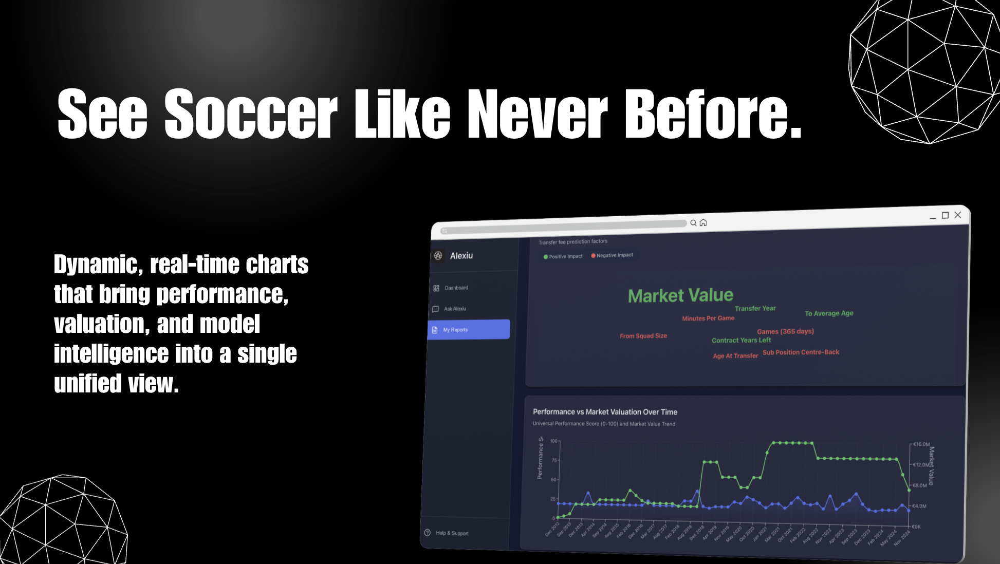 </p>

<p align="center"> 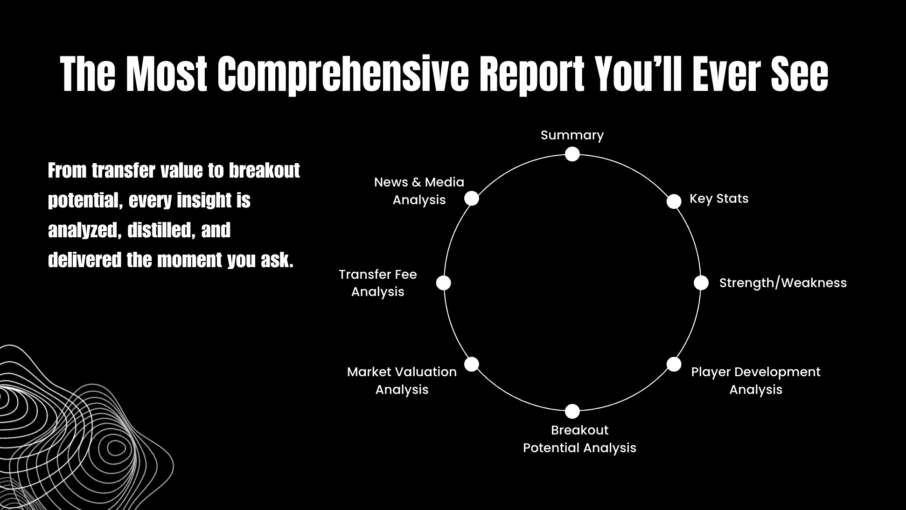 </p>
<p align="center"> 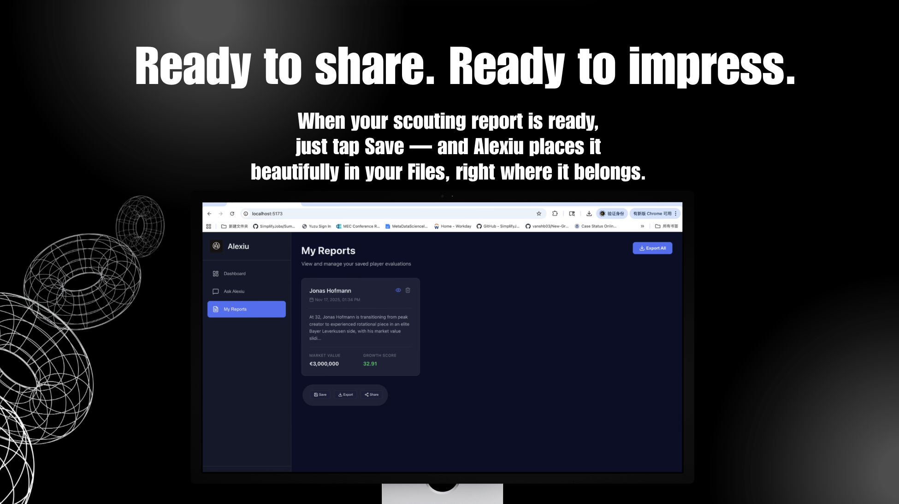 </p>

## 🌟 Features
Check the product webpage platform usage and features, please navigate to: [frontend webpage features](frontend/README.md)

### Core Capabilities
- **AI-Powered Player Reports**: Generate comprehensive evaluations using GPT analysis
- **Interactive Chatbot (Alexiu)**: Ask questions about player performance, strengths, and career trajectory
- **ML-Driven Insights**: 
  - XGBoost transfer fee predictions
  - SHAP (SHapley Additive exPlanations) feature importance analysis
  - MLR model coefficient explainer
  - Customized Growth Potential Scoring out of 100(MarketValueTrajectory(0–40) + PerformanceMomentum(0–40) + AgeWindow(0–20))
  - Time-series Customized Universal Score suitable for different positions
- **Visual Analytics**:
  - Word cloud visualization of key performance factors
  - Performance and market valuation time series charts
  - Career statistics dashboard
- **Player Search**: Real-time autocomplete search across the player database
- **Report Management**: Save, export, and manage player evaluation reports

<p align="center">
  <h3>Machine Learning Framework</h3>
  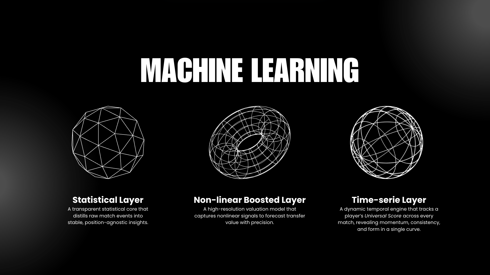
</p>


<p align="center"> 
<h3>Multi-Agent Framework</h3>
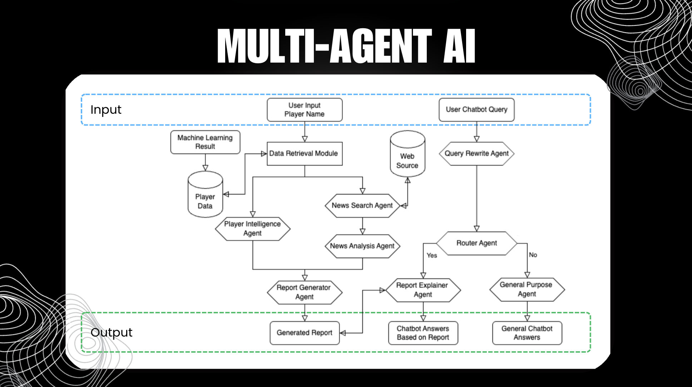 </p>


### Key Attributes Tracked
- Basic profile (age, position, club, nationality, preferred foot)
- Career statistics (goals, assists, matches, minutes played)
- Market valuation history and predictions
- Growth potential score
- Performance metrics and trends
- News context and recent developments

# 🖥️ Platform Screenshots

## Player Dashboard
⭐ Player Summary UI
Full player metadata, club, stats, and bio.

<p align="center"> 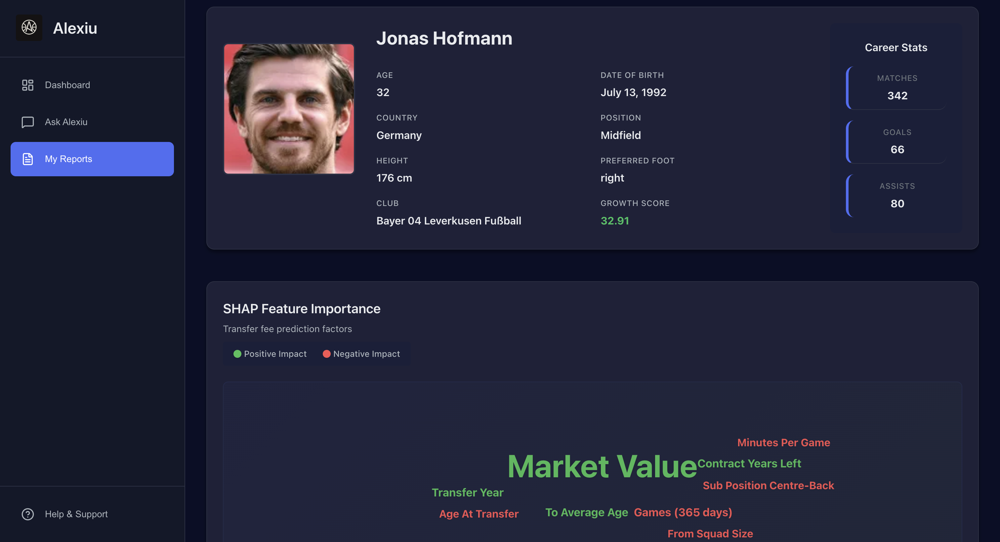 </p>
⭐ Word Cloud — Transfer Fee Drivers
<p align="center"> 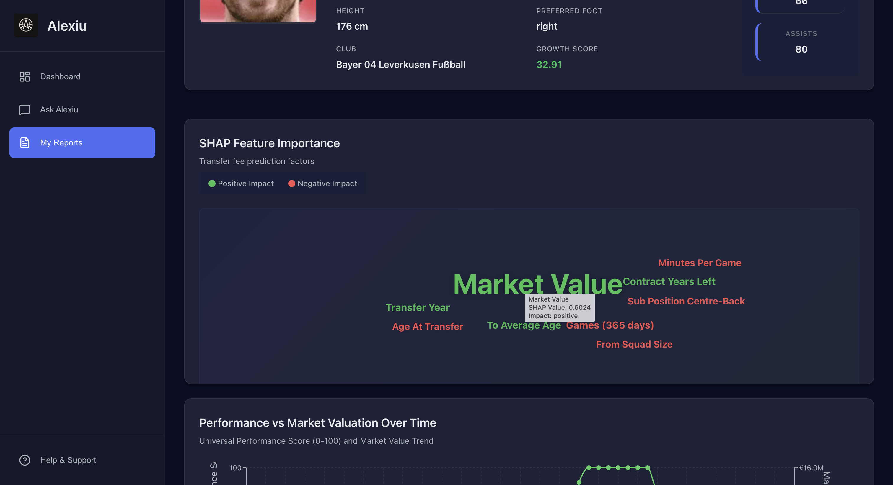 </p>
⭐ Performance vs Market Value Over Time
<p align="center"> 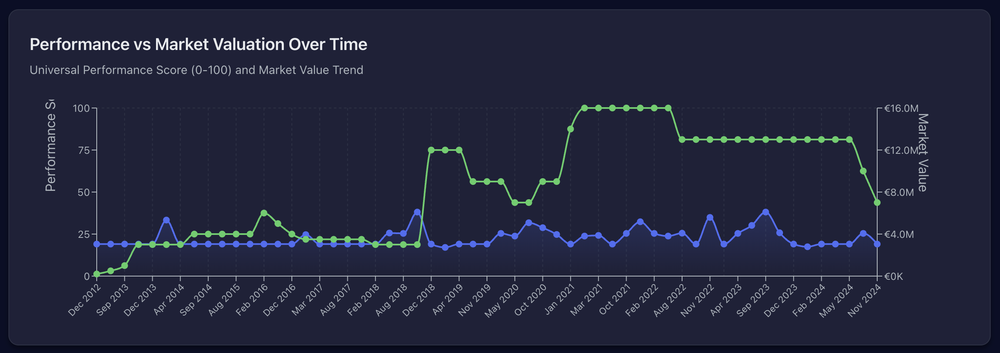 </p>

## AI Soccer Scout Report
⭐ Summary and recent performance
<p align="center"> 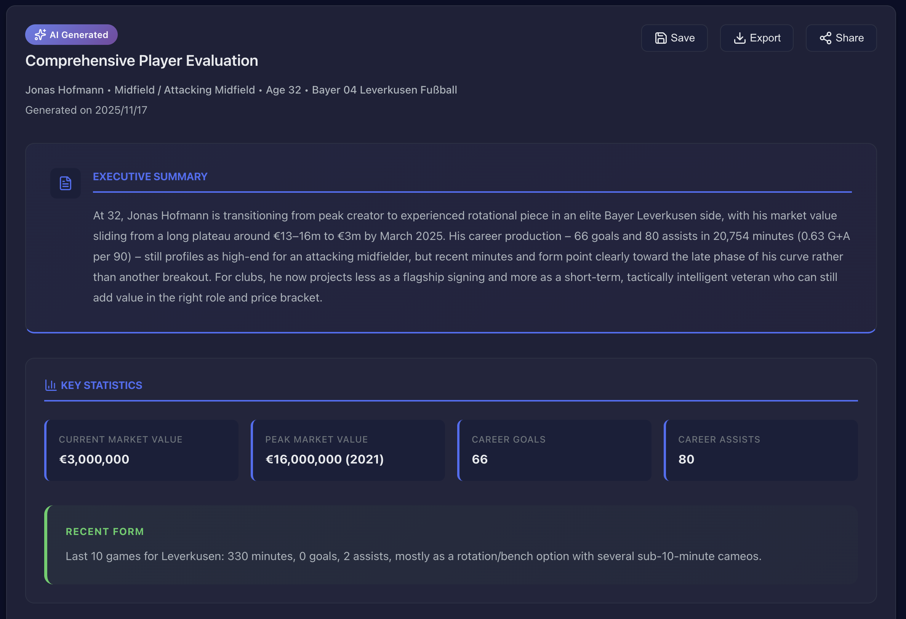 </p>

⭐ Strengths vs Weaknesses Panel
<p align="center"> 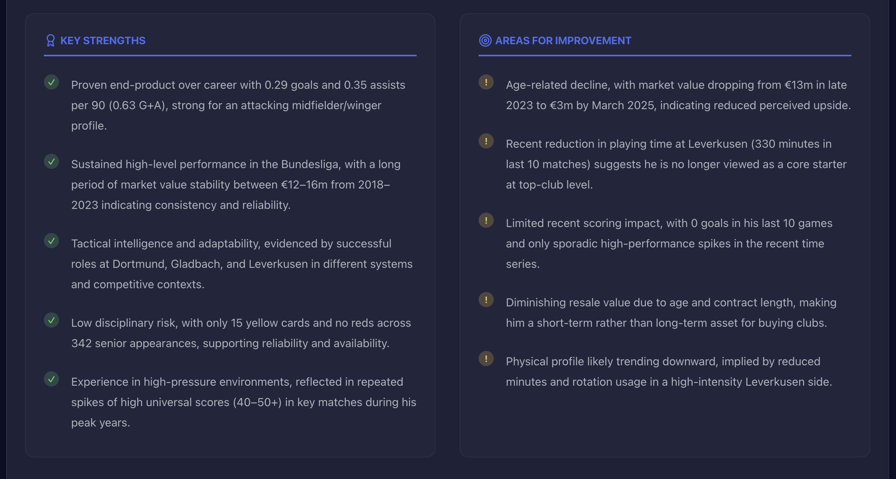 </p>
⭐ Deep-Dive Analysis Sections

Player development, breakout potential, market valuation insights, and detailed transfer-fee breakdown.

<p align="center"> 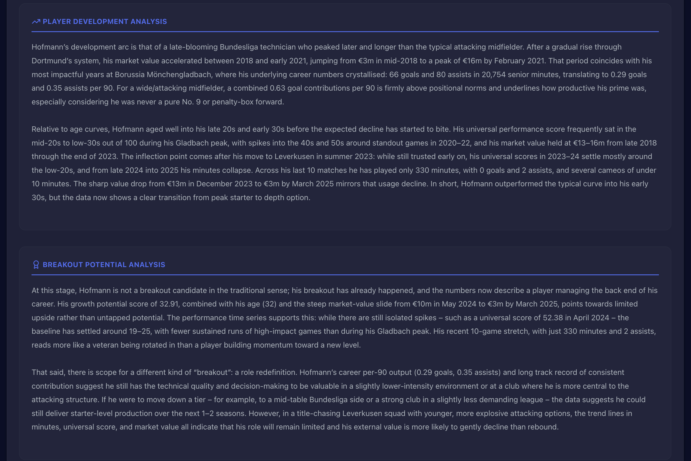 </p>
<p align="center"> 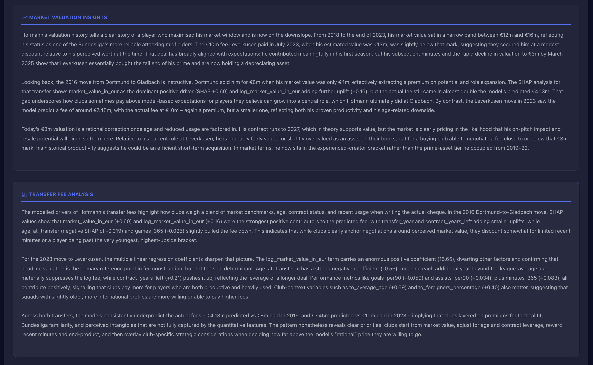 </p>
<p align="center"> 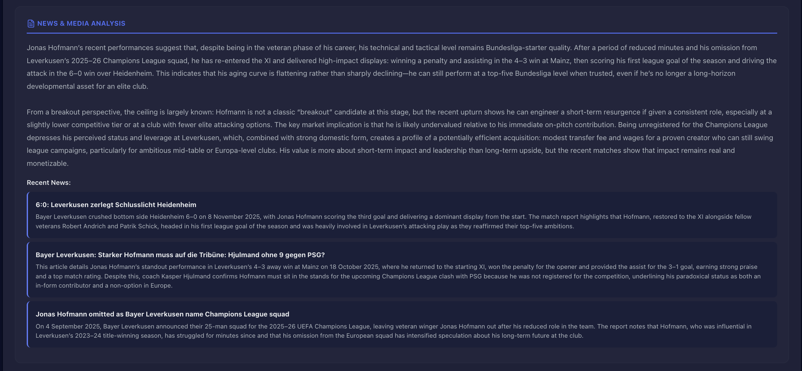 </p>
<p align="center">  </p>

## Function Highlights
⭐ AI Chatbot — Ask Anything

Ask detailed questions about transfers, performance, or analytics.

<p align="center"> 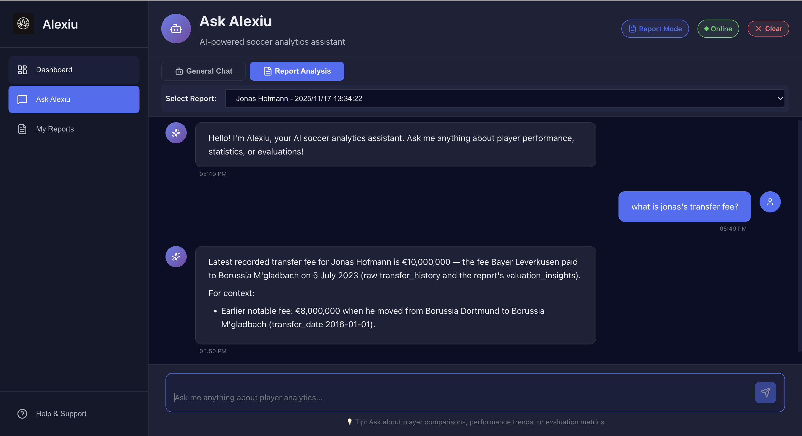 </p>

⭐ Saved Reports Dashboard

All generated reports stored cleanly with growth scores & valuation.

<p align="center"> 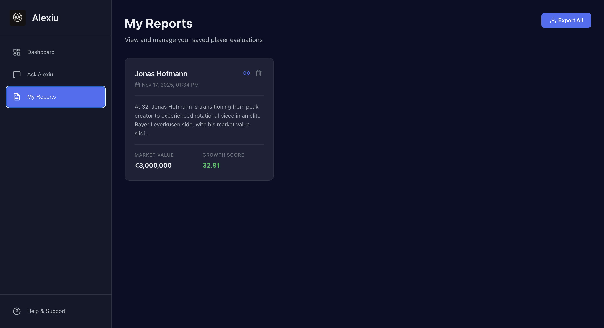 </p>

## 📋 Prerequisites

- **Python 3.11+**
- **Node.js 18+** and npm/yarn
- **OpenAI API Key** (for GPT report generation)
- **uv** (Python package manager) or pip

## 🚀 Quick Start

### Option 1: Using the Start Script (Windows)

```powershell
# Run the automated start script
.\start.ps1
```

This will:
1. Activate the virtual environment
2. Install missing dependencies
3. Start the backend API server (port 8000)
4. Start the frontend dev server (port 5173)

### Option 2: Manual Setup

#### Backend Setup

1. **Install uv (if not already installed):**

   **Windows (PowerShell):**
   ```powershell
   powershell -ExecutionPolicy ByPass -c "irm https://astral.sh/uv/install.ps1 | iex"
   ```

   **macOS/Linux:**
   ```bash
   curl -LsSf https://astral.sh/uv/install.sh | sh
   ```

2. **Sync dependencies:**
   ```bash
   uv sync
   ```

3. **Configure environment variables:**
   Create a `.env` file in the project root:
   ```env
   OPENAI_API_KEY=your_openai_api_key_here
   ```

4. **Start the backend server:**
   ```bash
   # Activate virtual environment
   .\.venv\Scripts\Activate.ps1  # Windows
   source .venv/bin/activate      # macOS/Linux

   # Run the API server
   uvicorn src.api.main:app --reload --host 0.0.0.0 --port 8000
   ```

#### Frontend Setup

1. **Navigate to frontend directory:**
   ```bash
   cd frontend
   ```

2. **Install dependencies:**
   ```bash
   npm install
   ```

3. **Configure API URL (optional):**
   Create a `.env` file in the `frontend` directory:
   ```env
   VITE_API_BASE_URL=http://localhost:8000
   ```

4. **Start development server:**
   ```bash
   npm run dev
   ```

5. **Access the application:**
   Open your browser to `http://localhost:5173`

## 🏗️ Project Structure

```
hackathon-2025-3to1/
├── src/                          # Backend Python source code
│   ├── api/                      # FastAPI application
│   │   ├── main.py              # API entry point
│   │   └── routes/              # API endpoints
│   │       ├── chatbot.py       # Chatbot interactions
│   │       ├── generator.py     # Report generation
│   │       └── player_search.py # Player search
│   ├── llm/                     # LLM orchestration
│   │   ├── agents/              # AI agents (analysis, news, etc.)
│   │   ├── clients/             # OpenAI client wrappers
│   │   └── orchestrators/       # Agent coordination
│   ├── json_generator/          # Player data processing
│   │   ├── build_player_json.py # JSON data builder
│   │   └── model_data/          # ML model outputs & player data
│   ├── models/                  # ML models (XGBoost, GLM, etc.)
│   ├── clients/                 # External API clients
│   └── utils/                   # Utility functions
├── frontend/                    # React frontend application
│   ├── src/
│   │   ├── components/          # React components
│   │   ├── services/            # API services
│   │   ├── utils/               # Helper functions
│   │   └── styles/              # Global styles
│   └── package.json
├── prompts/                     # LLM system & user prompts
│   ├── chatbot/                 # Chatbot agent prompts
│   └── report_generator/        # Report generation prompts
├── configs/                     # Configuration files
│   ├── model_configs.yaml       # LLM model settings
│   ├── prompt_configs.yaml      # Prompt configurations
│   └── schemas/                 # JSON schemas
├── data/                        # Source data files
│   └── players.csv              # Player database
├── pyproject.toml               # Python dependencies
└── start.ps1                    # Quick start script (Windows)
```

## 🔧 Configuration

### Model Configuration (`configs/model_configs.yaml`)
Configure GPT models for different agents:
- Analysis Agent (player insights)
- News Agent (recent developments)
- Generator Agent (report compilation)
- Chatbot agents (query routing, answering)

### Prompt Configuration (`configs/prompt_configs.yaml`)
Customize system and user prompts for:
- Report generation workflows
- Chatbot interactions
- Query routing and rewriting

## 📊 Data Pipeline

1. **Raw Data**: Player statistics from `data/players.csv`
2. **ML Processing**: XGBoost predictions, SHAP analysis
3. **JSON Generation**: Structured player profiles with ML insights
4. **LLM Enhancement**: GPT-4 analysis and report generation
5. **Frontend Display**: Interactive visualizations and reports

## 🛠️ API Endpoints

### Player Search
- `GET /api/players/search?query={name}&limit={n}` - Search players
- `GET /api/players/info/{player_id}` - Get player info
- `GET /api/players/generate/{player_id}` - Generate player JSON

### Report Generation
- `POST /api/reports/generate` - Generate comprehensive player report

### Chatbot
- `POST /api/chatbot/query` - Send chatbot query
- `POST /api/chatbot/end-session` - End chatbot session

### Health
- `GET /health` - API health check

## 🎨 Frontend Architecture

Built with React + Vite, featuring:
- **Dashboard**: Main analytics view with search and visualizations
- **Ask Alexiu**: Interactive AI chatbot for player insights
- **My Reports**: Saved report management
- **Components**:
  - PlayerInfo: Player profile display
  - AIReport: Generated report viewer
  - WordCloud: SHAP feature importance visualization
  - PerformanceChart: Time series analytics

## 🔐 Environment Variables

### Backend (.env)
```env
OPENAI_API_KEY=sk-...           # Required: OpenAI API key
```

### Frontend (frontend/.env)
```env
VITE_API_BASE_URL=http://localhost:8000  # Optional: API endpoint
```

## 📦 Dependencies

### Backend
- FastAPI - Web framework
- OpenAI - GPT-4 integration
- Pandas - Data processing
- PyYAML - Configuration management
- Uvicorn - ASGI server

### Frontend
- React 19 - UI framework
- Vite - Build tool
- Axios - HTTP client
- Recharts - Charts library
- D3-cloud - Word cloud visualization
- Lucide React - Icons

## 🧪 Development

### Backend Development
```bash
# Run with auto-reload
uvicorn src.api.main:app --reload

# Run tests (if available)
pytest tests/
```

### Frontend Development
```bash
cd frontend
npm run dev      # Development server
npm run build    # Production build
npm run preview  # Preview production build
npm run lint     # Run ESLint
```

## 📝 Usage Guide

1. **Search for a Player**: Use the search bar to find players by name
2. **Load Player Data**: Select from search results or upload JSON file
3. **Generate Report**: Click "Generate Report" to create AI analysis
4. **Save Report**: Click the "Save" button to store the report
5. **Ask Questions**: Go to "Ask Alexiu" to interact with the AI about saved reports
6. **Manage Reports**: View and manage saved reports in "My Reports"

## 🤝 Contributors

-Wuyou Shu
-Xiaoxiao Huang
-Zeyu Zhang

## 📄 License

NA

## 🙋 Support

For issues and questions:
- Check existing GitHub issues
- Create a new issue with detailed description
- Include error logs and steps to reproduce

## 🎯 Roadmap

- [ ] Add more ML models (performance prediction, injury risk)
- [ ] Real-time data updates
- [ ] Multi-language support
- [ ] Export reports to PDF
- [ ] Team comparison features
- [ ] Advanced filtering and search

---

**Built for NU AI Hackathon 2025**

